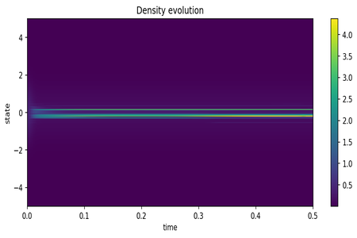
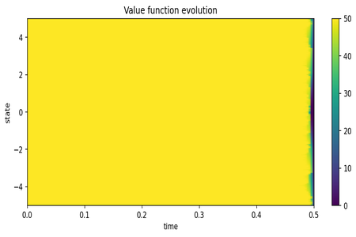
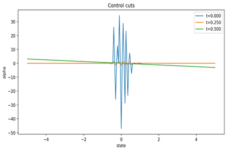
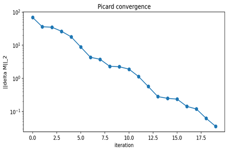
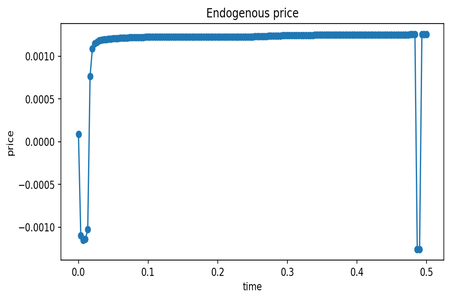

# Mean Field Games para o mercado brasileiro
Solver numérico de **Mean Field Games (MFG)** em 1D aplicado às ações da B3 de 2015 a 2025. O sistema acopla **Hamilton–Jacobi–Bellman (HJB)** e **Fokker–Planck (FP)** resolvidos por iteração de Picard com esquemas conservativos (Lax-Friedrichs + upwind). O projeto oferece CLI, notebook, scripts de preparação de dados e testes automatizados.

## Visão geral
Resumidamente, o projeto conecta otimização individual e efeitos de multidão no mercado. Em vez de modelar um trader isolado, usa-se a estrutura de Mean Field Games (MFG): cada agente escolhe suas ações para minimizar custos (por exemplo, custo de execução e carregar inventário), enquanto a média das escolhas afeta o ambiente que todos enfrentam.

### **O que o código faz**
- Resolve duas equações acopladas no tempo:
  - HJB (decisão ótima): calcula o “valor” de cada estado e a política ótima de negociação.
  - Fokker-Planck (população): descreve como a distribuição de posições dos agentes evolui.
- Encontra o equilíbrio por um laço de ponto-fixo (Picard), alternando HJB (para trás no tempo) e FP (para frente) até convergir.
- Usa esquemas numéricos estáveis reconhecidos na literatura: Lax-Friedrichs (gradiente monotônico) e upwind conservativo (advecção), com difusão implícita. Isso preserva massa ≈ 1 e impede densidades negativas — requisitos básicos para resultados confiáveis.
- Implementa um caso LQ (quadrático) inspirado em microestrutura/HFT: custo de execução, penalidade de inventário e (opcionalmente) custo dependente do fluxo médio do grupo.

### **Por que isso importa**
Esse arranjo permite experimentar hipóteses de mercado de forma controlada: como a liquidez muda quando negociar fica mais caro? O grupo tende a carregar mais ou menos inventário? A política ótima fica mais agressiva ou mais cautelosa? Os gráficos e métricas ajudam a visualizar esses regimes.

## Equações (visão rápida)

**HJB (backward)**

$$
\begin{cases}
& -\partial_t U(t,x) - \nu \Delta U(t,x) + H(\nabla U(t,x), m(t,x)) = 0 \\
& U(T,x) = \gamma_T x^2
\end{cases}
$$

**FP (forward)**

$$
\begin{cases}
& \partial_t m(t,x) - \nu \Delta m(t,x) - \nabla\cdot\big(m(t,x)v(t,x)\big) = 0 \\
& m(0,x) = m_0(x)
\end{cases}
$$

**Controle ótimo LQ**

$$
\begin{cases}
& \alpha^{*}(t,x) = -\frac{\partial_x U(t,x)}{\eta(m)} \\
& \eta(m) = \eta_0 + \eta_1 \lvert \overline{\alpha} \rvert
\end{cases}
$$

> **1D:** $\nabla U \equiv \partial_x U$ e $\nabla\cdot(mv)\equiv \partial_x(mv)$.

## Pipeline visual
*Distribuição do FP ao longo do tempo; a massa permanece conservada.*




*Função valor do HJB mostrando o custo futuro e o impacto das bordas.*




*Quatro cortes da política ótima $alpha(t,x)$ evidenciam o alisamento do controle.*




*Erro $L^2$ entre iterações Picard; a queda monotônica confirma estabilidade.*




*Trajetória do preço de clearing calibrado para média quase nula; oscilações refletem a oferta empírica.*



### Métricas salvas
`metrics.json` inclui:
- `final_error`, `final_error_relative`, `iterations`
- `mix_history`, `relative_errors`
- `mean_abs_alpha`, `std_alpha`, `liquidity_proxy`
- `price_mean`, `price_std`, `price_min`, `price_max`, `price_span` (quando o clearing roda)

## Ajustes finos
- `mix`, `mix_min`, `mix_decay`, `stagnation_tol`: controlam o amortecimento do Picard.
- `relative_tol`: critério relativo adicional (além do `tol` absoluto) para encerrar o laço.
- `hjb_inner` / `hjb_tol`: esforço interno do solver HJB.
- `solver.supply` e `solver.price_sensitivity`: curva empírica de oferta e sensibilidade de clearing (ver seção “Dados”). O baseline usa `price_sensitivity = 30.0`, obtendo preço médio ≈ 0.

## Dados e reprodução
1. **Ingestão COTAHIST** (não versionada): copie os arquivos originais para `data/raw/` e use os scripts em `scripts/` para gerar os Parquets de `data/processed/` (detalhes em `docs/DATA.md`).
2. **Curva de oferta** (quantis de volume/spread):
   ```bash
   python scripts/build_supply_curve.py      --input data/processed/cotahist_equities_extended.parquet      --output data/processed/supply_curve.csv
   ```
3. **Atualize o baseline** com a curva e a sensibilidade desejada:
   ```bash
   python scripts/update_solver_config.py      --supply data/processed/supply_curve.csv      --config configs/baseline.yaml      --scale 5e-05      --price-sensitivity 30.0
   ```
4. (Opcional) rode `python scripts/run_notebook_pipeline.py` para gerar `notebooks_output/run-YYYYmmdd-HHMMSS/`.

> **Aviso legal:** dados COTAHIST pertencem à B3. Certifique-se de possuir licença antes de utilizá-los.

## Instalação
```bash
git clone https://github.com/<org>/mfg-for-financial-market.git
cd mfg-for-financial-market
python -m venv .venv && . .venv/Scripts/activate  # Windows
# source .venv/bin/activate                       # macOS/Linux
pip install -e .[dev]
PYTHONPATH=src python -m pytest -q                # smoke opcional
```
> **Notebook**: se não instalar o pacote, garanta que `src/` esteja no `sys.path`. A primeira célula de `notebooks/mfg_pipeline.ipynb` já faz esse ajuste.

## Como rodar
```bash
# baseline com clearing endógeno
python -m mfg_finance.cli run --config configs/baseline.yaml --endogenous-price

# sweep de parâmetros (phi x gamma_T)
python -m mfg_finance.cli sweep   --config configs/baseline.yaml   --phi 0.02,0.035359,0.05   --gamma_T 0.4,0.568862
```
Artefatos vão para `artifacts/run-YYYYmmdd-HHMMSS/` ou `artifacts/sweep-.../` com arrays (`*.npy`), métricas (`metrics.json`), curvas de preço (`price.csv`) e figuras (`*.png`).


## Testes
```bash
PYTHONPATH=src python -m pytest -q
```
Os testes cobrem conservação de massa, positividade, convergência Picard e refinamento de malha.

## Estrutura do repositório
```
configs/                  # YAMLs reprodutíveis (baseline, sweeps)
docs/                     # documentação adicional (ex.: DATA.md)
data/                     # insumos brutos/derivados (não versionados)
examples/                 # scripts de experimentos rápidos
notebooks/                # notebooks exploratórios
notebooks_output/         # artefatos do pipeline/notebook
reports/                  # figuras e relatórios HTML/PNG
scripts/                  # utilidades de dados e pipeline
src/mfg_finance/          # implementação do solver
tests/                    # suíte PyTest
```

## Roadmap
- Acomodar modelos com ruído comum (SPDE).
- Implementar policy iteration / Newton para aceleração.
- Preço endógeno via mecanismos de clearing alternativos.
- Extensões 2D e problemas não quadráticos.


