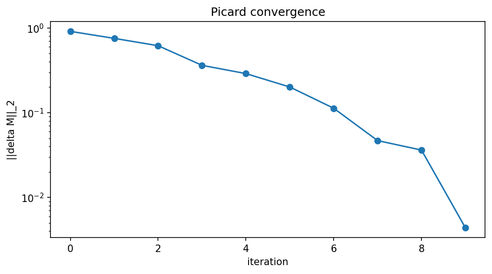
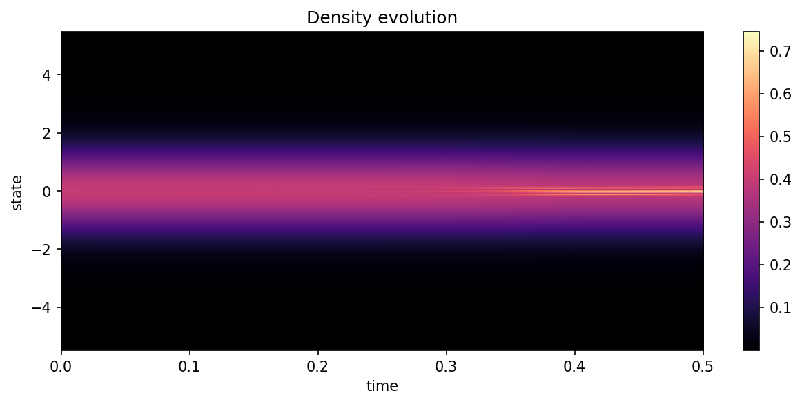
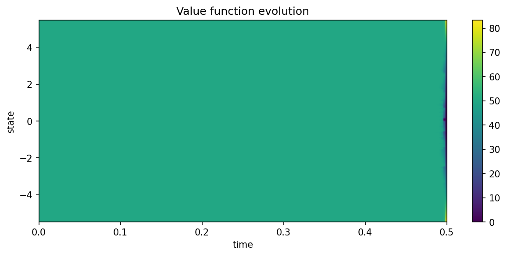
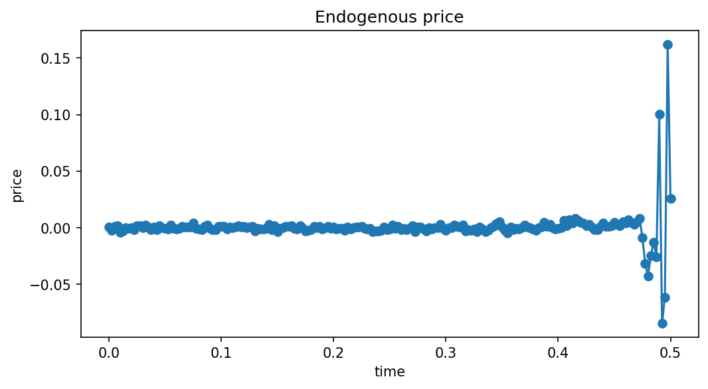

# Market Microstructure Simulator: Mean Field Games na B3

<div align="center">


[](LICENSE)


</div>

> **Simulação de Liquidez, Formação de Preços e High Frequency Trading (HFT)**

Este projeto é um laboratório computacional que simula a interação de milhares de agentes de mercado (robôs de alta frequência e market makers) para entender a dinâmica de liquidez na bolsa brasileira (B3). Utilizando a teoria de **Mean Field Games (MFG)**, modelamos como decisões individuais de execução impactam o macro-ambiente de preços.

---

## 🎯 O Problema de Negócio: Por que isso importa?
No mercado financeiro moderno, a liquidez não é estática. Grandes ordens sofrem **impacto de mercado** (slippage) e enfrentam o risco de seleção adversa. Este projeto responde a perguntas cruciais para mesas de execução e trading algorítmico:

1.  **Formação de Preço:** Como o preço de um ativo emerge da interação de milhares de ordens de compra e venda?
2.  **Gestão de Inventário:** Qual a penalidade ótima para carregar posição (*overnight* ou intraday)?
3.  **Execução Ótima:** Como "fatiar" uma ordem grande para minimizar o impacto no mercado?

Ao contrário de modelos simples que assumem preços exógenos (como Black-Scholes), aqui o **preço e a liquidez são endógenos**: eles nascem do comportamento agregado dos agentes.

## 📚 Tradutor: Matemática $\leftrightarrow$ Mercado
Para facilitar o entendimento da modelagem para profissionais de mercado:

| Conceito no Modelo (Math) | Tradução para o Mercado (Finance) |
| :--- | :--- |
| **Agente Representativo** | Um algoritmo de HFT ou *Market Maker* típico operando na B3. |
| **Estado ($x$)** | **Inventário (Position):** Quantos contratos o robô está comprado ou vendido. |
| **Controle ($\alpha$)** | **Velocidade de Trading:** A agressividade para limpar o inventário (market orders vs limit orders). |
| **Termo de Campo Médio ($m$)** | **Liquidez Agregada:** A distribuição de posicionamento de todos os participantes do mercado. |
| **Função Valor ($U$)** | **Custo de Execução:** A expectativa de perda financeira (custo + risco) até zerar a posição. |
| **Equilíbrio de Nash** | **Mercado Eficiente:** Ponto onde o fluxo de ordens se estabiliza dado o preço atual. |

---

## 💡 Insights de Microestrutura (Baseado em dados da B3 1986-2025)
O modelo foi calibrado utilizando dados históricos do **COTAHIST (B3)**, revelando comportamentos típicos de *market making*:

* **Suavização de Fluxo (Smoothing):** A política ótima encontrada sugere que a melhor estratégia não é zerar a posição imediatamente, mas sim diluir as ordens ao longo do tempo (similar a algoritmos **TWAP/VWAP**), reduzindo o impacto no preço.
* **Aversão à Posição:** A densidade de probabilidade se concentra em zero ao final do pregão. Isso reflete a realidade de HFTs que evitam carregar risco *overnight*, retornando a posições neutras rapidamente.
* **Liquidez Resiliente:** Em condições normais, o *clearing* de mercado absorve choques de oferta/demanda, mantendo o preço médio estável (oscilações próximas de zero no referencial do modelo).

## 📊 Pipeline Visual e Resultados

Esta seção demonstra a estabilidade numérica do solver e a coerência financeira dos resultados.

### 1. Estabilidade Numérica (Picard Convergence)

*A curva decrescente quase linear (em escala logarítmica) indica **convergência exponencial**. Isso prova a robustez do acoplamento entre as equações HJB e Fokker-Planck e a eficácia do método de ponto fixo com amortecimento adaptativo.*

### 2. Comportamento da Multidão (Density Evolution)

*Visualização da aversão ao risco de overnight. Em $t=0$, as posições estão dispersas (roxo difuso). Conforme $t \to T$ (final do pregão), a massa converge agressivamente para o centro (linha amarela), indicando que os agentes estão liquidando suas posições para evitar penalidades terminais.*

### 3. Incentivos de Custo (Value Function)

*Mapa de calor do custo esperado. Note a "parede terminal" (faixa amarela brilhante à direita): ela representa o custo proibitivo de terminar o dia posicionado, forçando a estratégia de liquidação observada na evolução da densidade.*

### 4. Agressividade da Estratégia (Control Cuts)

*Cortes transversais da velocidade de trading. O pico verde ($t=0.25$) é significativamente maior que o azul ($t=0$), demonstrando que a urgência (agressividade) do agente aumenta exponencialmente conforme o fim do pregão se aproxima.*

### 5. Preço de Clearing (Endogenous Price)

*O preço resultante da interação de todos os agentes. A estabilidade inicial indica absorção de liquidez, enquanto a oscilação violenta no final ilustra um **Liquidity Crunch**: o desequilíbrio momentâneo causado pela corrida simultânea de todos os agentes para zerar posições.*

---

## ⚙️ Deep Dive Técnico (Para Quants e Devs)

Abaixo do capô, este projeto é um *solver* numérico de Alta Performance em Python.

### O Modelo Matemático
O sistema resolve um par de equações diferenciais parciais (EDPs) acopladas:

**HJB (backward)**

$$
\begin{cases}
& -\partial_t U(t,x) - \nu \Delta U(t,x) + H(\nabla U(t,x), m(t,x)) = 0 \\
& U(T,x) = \gamma_T x^2
\end{cases}
$$

**FP (forward)**

$$
\begin{cases}
& \partial_t m(t,x) - \nu \Delta m(t,x) - \nabla\cdot\big(m(t,x)v(t,x)\big) = 0 \\
& m(0,x) = m_0(x)
\end{cases}
$$

**Controle ótimo LQ**

$$
\begin{cases}
& \alpha^{*}(t,x) = -\frac{\partial_x U(t,x)}{\eta(m)} \\
& \eta(m) = \eta_0 + \eta_1 \lvert \overline{\alpha} \rvert
\end{cases}
$$

> **1D:** $\nabla U \equiv \partial_x U$ e $\nabla\cdot(mv)\equiv \partial_x(mv)$.

### Arquitetura e Implementação
* **Método Numérico:** Iteração de **Picard** com amortecimento adaptativo para encontrar o Ponto Fixo (Equilíbrio).
* **Discretização:** Diferenças Finitas com esquemas conservativos (**Lax-Friedrichs + Upwind**) para garantir estabilidade numérica.
* **Pipeline de Dados:** Scripts ETL robustos para processar gigabytes de dados brutos da B3 (COTAHIST).
* **Engenharia:**
    * Testes automatizados (`pytest`) cobrindo conservação de massa e convergência.
    * Configuração via YAML e CLI para reprodutibilidade total.
    * Typing rigoroso e modularização.

---

## 🚀 Como Rodar

### Instalação
```bash
git clone [https://github.com/cockles98/mfg-for-financial-market.git](https://github.com/cockles98/mfg-for-financial-market.git)
cd mfg-for-financial-market
python -m venv .venv && . .venv/Scripts/activate
pip install -e .[dev]
```

### Executando uma Simulação
```bash
# Rodar baseline com clearing endogeno
python -m mfg_finance.cli run --config configs/baseline.yaml --endogenous-price
```

### Reproduzindo com Dados Reais
1.  Adicione os arquivos COTAHIST em `data/b3/`.
2.  Execute a ingestão e calibração:
    ```bash
    python scripts/ingest_cotahist.py
    python scripts/calib_empirical.py
    ```

-----

**Disclaimer:** Este projeto é para fins acadêmicos e de pesquisa. Dados de mercado (COTAHIST) pertencem à B3.


