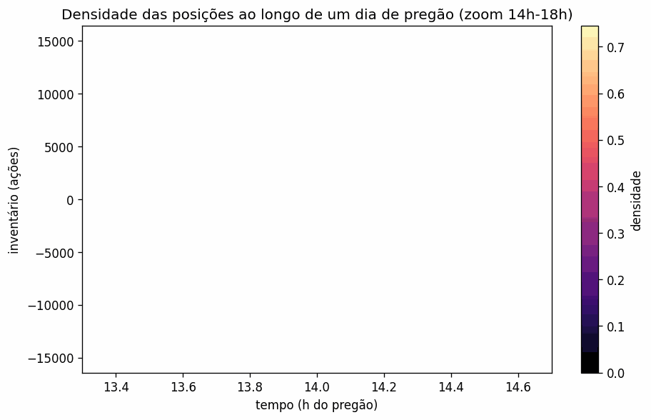
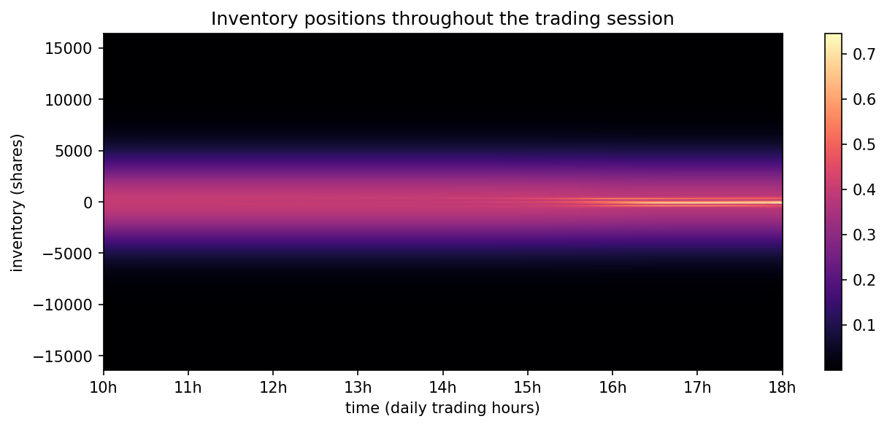
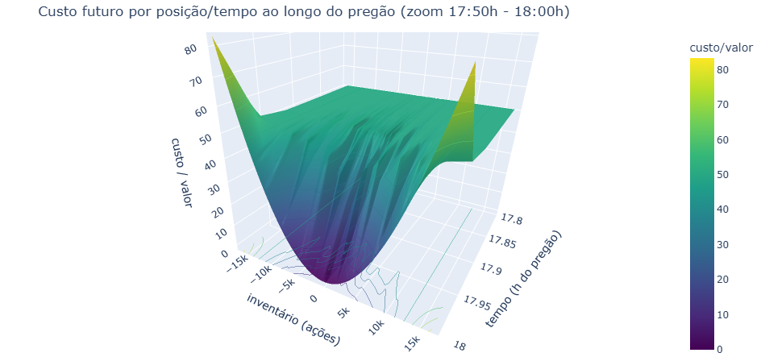
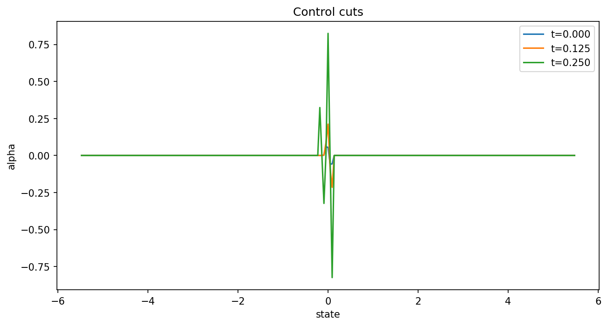
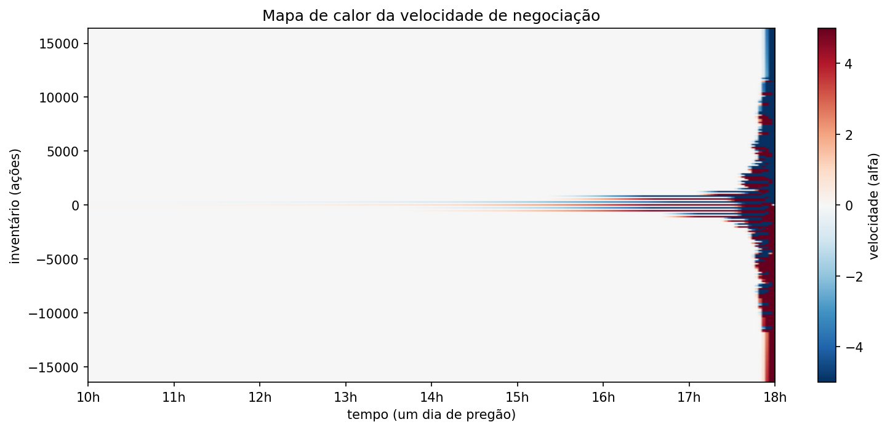
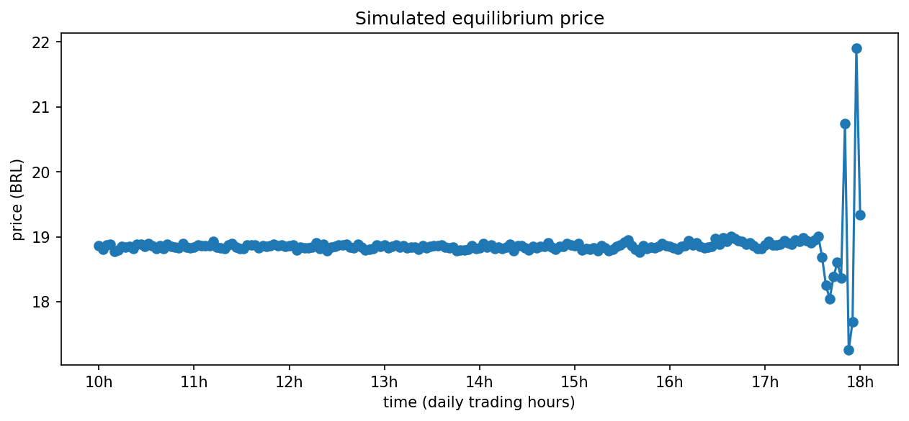

# Market Microstructure Simulator: Mean Field Games on the B3

<div align="center">


[](LICENSE)


</div>

> **Simulating Liquidity, Price Formation, and High-Frequency Trading (HFT)**

This project is a computational laboratory that simulates the interaction of thousands of market agents (high-frequency algorithms and market makers) to understand liquidity dynamics on the Brazilian stock exchange (B3). Using **Mean Field Game (MFG)** theory, we model how individual execution decisions aggregate into macro-level price dynamics — where price and liquidity are not assumed, but *emerge* from agent behavior.

---

## 🎯 The Business Problem: Why Does This Matter?

In modern financial markets, liquidity is not static. Large orders suffer **market impact** (slippage) and face adverse selection risk. This project addresses questions that are critical for execution desks and algorithmic trading:

1. **Price Formation:** How does an asset's price emerge from the interaction of thousands of buy and sell orders?
2. **Inventory Management:** What is the optimal penalty for carrying a position overnight or intraday?
3. **Optimal Execution:** How should a large order be sliced to minimize market impact?

Unlike simple models that assume exogenous prices (such as Black-Scholes), here **price and liquidity are endogenous** — they arise from the aggregate behavior of agents.

---

## 📚 Translator: Math ↔ Market

To bridge the gap between the mathematical model and practical market intuition:

| Model Concept (Math) | Market Translation (Finance) |
| :--- | :--- |
| **Representative Agent** | A typical HFT algorithm or Market Maker operating on the B3. |
| **State ($`x`$)** | **Inventory (Position):** How many contracts the algorithm is long or short. |
| **Control ($`\alpha`$)** | **Trading Speed:** Aggressiveness in clearing inventory (market orders vs. limit orders). |
| **Mean Field Term ($`m`$)** | **Aggregate Liquidity:** The positioning distribution of all market participants. |
| **Value Function ($`U`$)** | **Execution Cost:** Expected financial loss (cost + risk) until the position is fully unwound. |
| **Nash Equilibrium** | **Efficient Market:** The point where order flow stabilizes given the current price. |

---

## 💡 Microstructure Insights (Calibrated on B3 Data, 1986–2025)

The model was calibrated using historical **COTAHIST (B3)** data, revealing behavior consistent with real market making dynamics:

- **Order Flow Smoothing:** The optimal policy suggests that the best strategy is not to unwind immediately, but to dilute orders over time — similar to **TWAP/VWAP** algorithms — reducing price impact.
- **Overnight Risk Aversion:** Probability density concentrates around zero inventory by end of session, reflecting the well-known HFT behavior of avoiding overnight risk and returning to neutral positions quickly.
- **Resilient Liquidity:** Under normal conditions, market clearing absorbs supply/demand shocks, keeping the average price stable. Under stress, the model reproduces a **Liquidity Crunch** — a phenomenon that emerges purely from agent interaction.

---

## 📊 Visual Pipeline & Results

This section demonstrates the numerical stability of the solver and the financial coherence of the results.

### 1. Numerical Stability (Picard Convergence)

<div align="center">
  
</div>

> *The near-linear decreasing curve (in log scale) indicates **exponential convergence** — proving the robustness of the HJB–Fokker-Planck coupling and the effectiveness of the fixed-point iteration with adaptive damping.*

### 2. Crowd Behavior (Density Evolution)

<div align="center">
  
</div>

<div align="center">
  
</div>

> *Visualization of overnight risk aversion. At $`t = 10h`$, positions are dispersed (diffuse purple). As $`t \to 18h`$ (end of session), mass converges aggressively toward zero (yellow line), indicating agents liquidating positions to avoid terminal penalties.*
> > *Note: positive inventory = long position; negative inventory = short position.*

### 3. Cost Incentives (Value Function)

<div align="center">
  
</div>

<div align="center">
  
</div>

> *Heatmap of expected execution cost. Note the "terminal wall" (bright yellow band at the edges): it represents the prohibitive cost of ending the day with open positions, forcing the liquidation behavior observed in the density evolution.*
> > *Note: positive inventory = long position; negative inventory = short position.*

### 4. Strategy Aggressiveness (Control Cuts)

<div align="center">
  
</div>

<div align="center">
  
</div>

> *Cross-sectional cuts of trading speed. The green peak ($`t = 14h`$) is significantly larger than the blue ($`t = 10h`$), demonstrating that agent urgency increases exponentially as the session close approaches.*

### 5. Endogenous Clearing Price

<div align="center">
  
</div>

> *The price that emerges from the interaction of all agents. Initial stability reflects liquidity absorption, while the sharp oscillation at the end illustrates a **Liquidity Crunch**: the momentary imbalance caused by all agents simultaneously rushing to unwind positions.*

---

## ⚙️ Technical Deep Dive (For Quants & Developers)

Under the hood, this project is a high-performance numerical PDE solver in Python.

### The Mathematical Model

The system solves a coupled pair of partial differential equations (PDEs):

**HJB (backward)**

$$
\begin{cases}
& -\partial_t U(t,x) - \nu \Delta U(t,x) + H(\nabla U(t,x), m(t,x)) = 0 \\
& U(T,x) = \gamma_T x^2
\end{cases}
$$

**FP (forward)**

$$
\begin{cases}
& \partial_t m(t,x) - \nu \Delta m(t,x) - \nabla\cdot\big(m(t,x)v(t,x)\big) = 0 \\
& m(0,x) = m_0(x)
\end{cases}
$$

**Optimal LQ Control**

$$
\begin{cases}
& \alpha^{*}(t,x) = -\frac{\partial_x U(t,x)}{\eta(m)} \\
& \eta(m) = \eta_0 + \eta_1 \lvert \overline{\alpha} \rvert
\end{cases}
$$

> **1D:** $\nabla U \equiv \partial_x U$ and $\nabla\cdot(mv)\equiv \partial_x(mv)$.

### Architecture & Implementation

- **Numerical Method:** **Picard iteration** with adaptive damping to find the fixed point (equilibrium).
- **Discretization:** Finite difference schemes with conservative methods (**Lax-Friedrichs + Upwind**) for numerical stability.
- **Data Pipeline:** Robust ETL scripts to process gigabytes of raw B3 data (COTAHIST).
- **Engineering:**
  - Automated tests (`pytest`) covering mass conservation and convergence guarantees
  - YAML configuration and CLI for full reproducibility
  - Strict typing and modular structure

---

## 🚀 Getting Started

### Installation
```bash
git clone https://github.com/cockles98/mfg-for-financial-market.git
cd mfg-for-financial-market
python -m venv .venv && . .venv/Scripts/activate
pip install -e .[dev]
```

### Running a Simulation
```bash
# Run baseline with endogenous clearing price
python -m mfg_finance.cli run --config configs/baseline.yaml --endogenous-price
```

> **The full pipeline is also available in `notebooks/mfg_pipeline.ipynb` — just run the cells in sequence to reproduce all results.**

---

*Interested in similar work — quantitative modeling, market microstructure, or numerical methods for finance? Feel free to reach out via [LinkedIn](https://www.linkedin.com/in/felipe-cockles) or [email](mailto:felipe.cockles@hotmail.com).*
